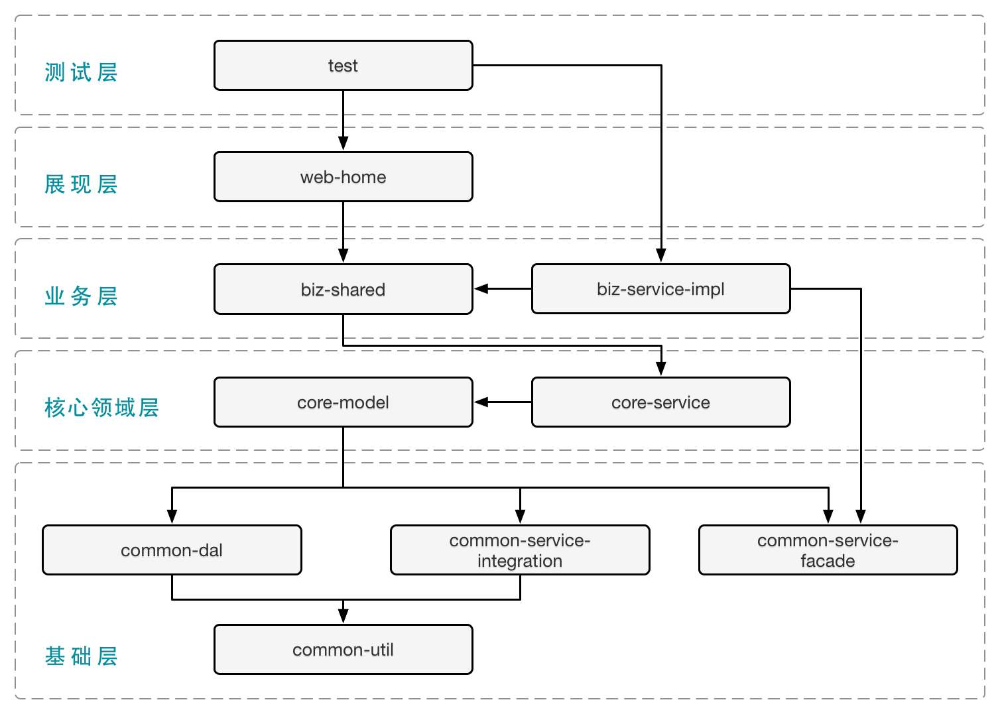

# springboot 测试
1. 异步注解
2. 发送QQ邮件
3. spring bean初始化执行代码的几种方式
4. springBoot使用Spring Data Elasticsearch Repositories操作Elasticsearch
5. ElasticsearchRestTemplate 方式操作es
6. RestHighLevelClient 操作ES
7. SpringBoot集成mybatis
8. 简单定时任务 ScheduleTask  问题1.重启还原[持久化数据库]2.任务会等上一次完成后，才开始触发下次任务

说明：按道理来说项目应该进行分model，一般不建议存储层，业务层，展示层在一个model里面，推荐sofaBoot分层，或者更进一步，先领域模块划分之后再进行分层（建议CQRS），保证每个model内聚性以及model
之间对象不互传污染下一层

